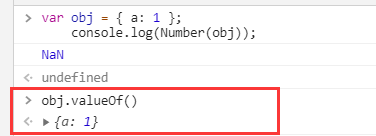
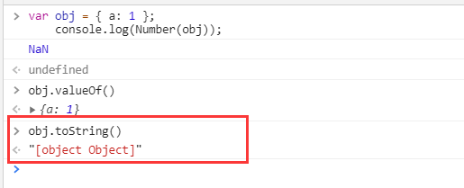
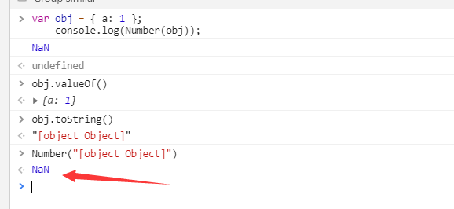
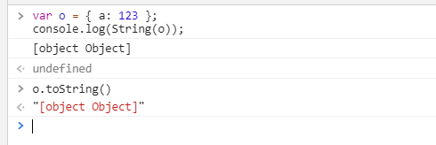
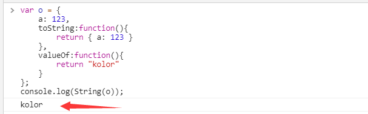
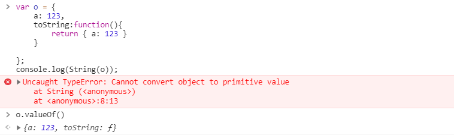

# 类型转换

> Tips：我们都知道 JavaScript 是动态类型语言，只有在运行的时候才能确认值的数据类型,所以 JavaScript 中的取值类型是非常的灵活的。我们拿它的基本类型 Boolean 来举例：当 JavaScript 期望使用一个布尔值的时候，你可以提供任何类型值，JavaScript 将会根据需要自动转换类型。一些值(真值)转换为 true，其他值(假值)转换为 false。JavaScript 的其他类型也是同样适用。

要想知道什么是数据类型转换，首先得知道什么是数据类型，我们先来看看 JavaScript 中数据类型有哪些

## 数据类型

最新的 ECMAScript 标准 定义了七种数据类型

**原始类型**

Boolean Null Undefined String Number Symbol(ES6 新增)

**引用类型**

Object

### 数据类型检测

typeof()：是 JavaScript 用来检测数据类型而暴露出来的全局方法，它最终返回的值有六种：<br /> **number**、**string**、**boolean**、**object**、**function**、**undefined** <br /> typeof 是唯一一个使用未定义的变量不会报错的 API，传入未定义的变量，它会返回一个 undefined。并且 typeof 返回的值都是字符串类型,值得注意的是 typeof(null) 不会返回预想的 null，而是"object"，这是历史遗留问题

## 显示类型转换

显示类型转换说白了，就是显示的去调用 JavaScript 的 **Number 函数**、**String 函数** 、**Bollean 函数**中的其中一个来进行显示转换的操作，我们在定义变量的时候，是不需要去指定变量的数据类型的，所以 JavaScript 中变量的数据类型是可以进行转换的。那我们下来就分别说下调用这几个函数的情况：

### 显示类型转换-Number 函数

#### 原始类型转换

- **数值**：转换后还是原来的值
- **字符串**：如果可以被解析为数值，则转换为相应的数值，否则转为 NaN，空字符串转为 0
- **布尔值**：true 转为 1，false 转为 0
- **undefined**：转为 NaN
- **null**：转为 0

**代码演示**

```JavaScript
    // 转换后还是原来的值
    console.log(Number(324)); // 324

    // 如果可以被解析为数值，则转换为相应的数值，否则转为 NaN，空字符串转为 0
    console.log(Number('324')); // 324
    console.log(Number('324abc')); // NaN
    console.log(Number('')); // 0

    // true 转为 1，false 转为 0
    console.log(Number(false)); // 0
    console.log(Number(true)); // 1

    // 转为 NaN
    console.log(Number(undefined));  // NaN

    // 转为0
    console.log(Number(null)); // 0

```

#### 引用类型转换

相对来说，原始类型转换都比较简单和容易理解，但是如果传入的是一个对象呢，我们来看看传入引用类型的转换规则，简单总结下就是：

- 先调用对象自身的 valueOf 方法，如果该方法返回原始类型的值（数值、字符串、和布尔值），则直接对该值使用 Number 方法，就回到上面我们所说的原始类型的值的转换，最终转换的结果就作为本次的转换结果，不再进行后续步骤。
- 如果 valueOf 方法返回的值引用类型的值，再调用对象自身的 toString 方法，如果 toString 方法返回原始类型的值，则对该值使用 Number 方法，不再继续后续操作
- 如果 toString 方法返回的是引用类型的值，则报错，这次显示转换就失败了。

**代码演示**

```JavaScript
    var obj = { a: 1 };
    console.log(Number(obj)); // NaN
```

上述代码最终得到的值是 NaN，我们要检验这个值是否正确很简单，直接把代码复制到控制台就能得到答案。但是这个 NaN 到底是怎么来的呢，我们得去搞明白

按照上面引用类型转换的步骤，我们一步步去探索

1. 先调用自身的 valueOf 方法我们看看输出的值是什么

   

2. 可以看到调用对象的 valueOf 方法返回的值是个引用类型，那按照上面的描述，又去调用对象的 toString 方法，最终得到的结果如下

   

3. 可以看到调用对象的 toString 方法之后我们得到的是一个原始类型字符串值，那按照上面的叙述我们再去把这个值传入 Number 函数，看看最终结果：

   

4. 整个流程下来就得到了我们最初的 **NaN** 这个值

### 显示类型转换-String 函数

#### 原始类型转换

- **数值**：转换为相应的字符串
- **字符串**：转换后还是原来的值
- **布尔值**：true 转为 “true”，false 转为 “false”
- **undefined**：转为 “undefined”
- **null**：转为 “null”

**代码演示**

```JavaScript
    console.log(String(123)); // "123"
    console.log(String("abc")); // "abc"
    console.log(String(true)); // "true"
    console.log(String(undefined)); // "undefined"
    console.log(String(null)); // "null"
```

String()函数的原始类型转换相比 Number 的话就更加简单了 都是转为值对应的字符串

#### 引用类型转换

String 函数的引用类型转换的规则如下：

- 先调用 toString 方法，如果 toString 方法返回的是原始类型的值，则对该值调用 String 方法，最终得到的值最为本次引用类型转换的值，不再继续以下步骤
- 如果 toString 方法返回的是引用类型的值，再调用对象的 valueOf 方法，如果 valueOf 方法返回的是原始类型的值，则对该值使用 String 方法，同样，不再继续以下步骤
- 如果 valueOf 方法返回的是引用类型的值，则抛出错误，代表此次类型转换失败

**代码演示**

```JavaScript
    var o = { a: 123 };
    console.log(String(o)); // [object Object]
```

1. 这次呢 先调用对象的 toString 方法，就直接会得到一个原始类型的值 "[object Object]",如下图。所以最终到此就结束了，因为得到了理想的值。
   
2. 但是我们不确定的是如果 toString 方法返回的是引用类型的话，还会不会去调对象的 valueOf 方法，所以我们稍微改下代码去验证。

```JavaScript
    // 我们重写对象的toString方法和valueOf方法
    var o = {
        a: 123,
        toString:function(){
            return { a: 123 }
        },
        valueOf:function(){
            return "kolor"
        }
    };
    console.log(String(o)); // kolor
```

1. 可以看到我们重写 toString 方法返回一个引用类型的值，对象确实去调了自己的 valueOf 方法，最终得到的值也是我们定义好的字符串 kolor
   

2. 如果我们不改写 valueOf，就让对象调用自身的 valueOf 方法我们再去看看结果

```JavaScript

    var o = {
        a: 123,
        toString:function(){
            return { a: 123 }
        }

    };
    console.log(String(o));  // Uncaught TypeError: Cannot convert object to primitive value
```

5. 得到的结果是抛出的一个类型错误，我们自己再手动调用下对象的 valueOf 方法，确实看到返回的还是一个引用类型，所以才会抛出错误
   

6. 整个流程下来我们便清晰的知道了引用类型调 String 方法去转换的话，确实会首先调用对象的 toString 方法，改方法返回值为引用类型的时候才会又去调用对象的 valueOf 方法，最终根据 valueOf 方法的返回值来确定值或者报错

### 显示类型转换-Boolean 函数

#### 原始类型转换

Boolean 函数的类型转换的话就比较简单，以下的几个值通通转换为 **false**，其他则为 **true**

- undefined
- null
- -0
- +0
- NaN
- ''(空字符串)

**代码演示**

```JavaScript

    console.log(Boolean(undefined)); // false

    console.log(Boolean(null)); // false

    console.log(Boolean(0)); // false

    console.log(Boolean(NaN)); // false

    console.log(Boolean('')); // false

    console.log(Boolean([])); // true

    console.log(Boolean({})); // true
```

## 隐式类型转换

上面我们讲的都是需要开发人员主动调用方法进行的显示类型转换，接下来我们说说隐式类型转换

> 下表是简要的 JavaScript 中的类型转换(空格表示不必要也没有进行类型转换)

| 值                   | 字符串          | 数字 | 字符串 | 对象                  |
| -------------------- | --------------- | ---- | ------ | --------------------- |
| undefined            | "undefined"     | NaN  | false  | throws TypeError      |
| null                 | "null"          | 0    | false  | throws TypeError      |
| true                 | "true"          | 1    |        | new Boolean(true)     |
| false                | "false"         | 0    |        | new Boolean(false)    |
| ""(空字符串)         |                 | 0    | false  | new String("")        |
| "1.2"(非空，数字)    |                 | 1.2  | true   | new String("1.2")     |
| "one"(非空，非数字)  |                 | NaN  | true   | new String('one')     |
| 0                    | "0"             |      | false  | new Number(0)         |
| -0                   | "0"             |      | false  | new Number(-0)        |
| NaN                  | "NaN"           |      | false  | new Number(NaN)       |
| Infinity             | "Infinity"      |      | true   | new Number(Infinity)  |
| -Infinity            | "-Infinity"     |      | true   | new Number(-Infinity) |
| 1(无穷大，非零)      | "1"             |      | true   | new Number(1)         |
| {}(任意对象)         |                 |      | true   |
| \[\]                 | ""              | 0    | true   |
| \[9\](1 个数字元素)  | "9"             | 9    | true   |
| \['a'\](其他数组)    | 使用 join()方法 | NaN  | true   |
| function(){任意函数} |                 | NaN  | true   |

## 转换和相等性

- 由于 JavaScript 可以做灵活的类型转换，因此其 "==" 想等运算符也随相等的含义灵活多变。例如，如下这些比较结果均为 true：

```JavaScript
null == undefined   // 这两值被认为是相等的
"0" == 0            // 在比较之前字符串被转换为数字
0 == false          // 在比较之前布尔值被转换为数字
"0" == false        // 在比较之前字符串和布尔值都转换为数字
```

> Tips：需要注意的是，一个值转换为另外一个值并不意味着两个值相等。比如，如果在期望使用布尔值的地方使用的 undefined，它将转换为 false，但这并不代表着 undefined == false。JavaScript 运算符和语句期望使用多样化的数据类型，并可以互相转换。if 语句将 undefined 转换为 false，但 "==" 运算符从不试图将操作数转换为布尔值。

- 严格相等运算符 "===" 的比较规则，首先会计算其操作数的值，然后再比较这两个值，比较过程没有任何类型转换：

```JavaScript
    - 如果两个值类型不相同，则他们不相等
    - 如果两个值都是null或者都是undefined，则他们不相等
    - 如果两个值都是true或者都是false，则他们相等
    - 如果其中一个值是NaN，或者两个值都是NaN，则他们不相等。NaN和其他任何值都不相等，包括它本身！所以可以通过 x!==x判断x是否为NaN，只有x为NaN的时候，这个表达式的结果才是true
    - 如果两个值为数字且数值相等，则他们相等。如果一个是0，一个是-0，则他们同样相等
    - 如果两个引用值指向的是同一个对象、数组或函数，则他们是相等的。如果指向不同发对象，则他们是不相等的，尽管两个对象的具有完全一样的属性和方法。
```

- 相等运算符 "==" 和恒等运算符相似，但是比较并不严格：如果两个操作数不是同一类型，那么相等运算符会尝试进行一些类型转换，然后再进行比较：如下规则

```JavaScript
    - 如果两个操作数的类型相等，就和上面的恒等运算符发比较规则一样。如果严格相等，那么比较结果就相等。如果不严格相等，则比较结果不相等
    - 如果操作数类型不同， “==” 相等运算符也可能hi认为他们相等。检测将会遵守如下规则和类型转换：
        * 如果一个值是null，另一个是undefined，则它们相等
        * 如果一个值是数字，另外一个数字符串，先将字符串转换为数字。然后使用转换后的值进行比较
        * 如果其中一个值是true，则将其转换为1再进行比较。如果一个值是false，则将其转换为0在进行比较
        * 如果一个值是对象，另外一个是字符串或者数字，则通过上表中的转换规则将对象转换为原始值，然后再进行比较。
        * 其余不同类型之间比价均不相等
```
