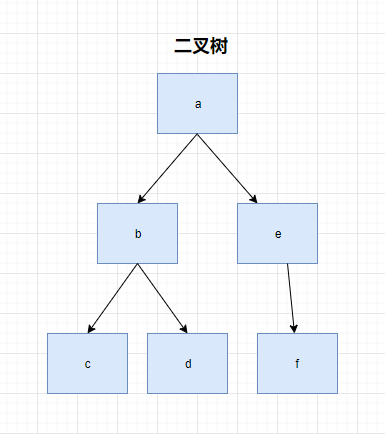
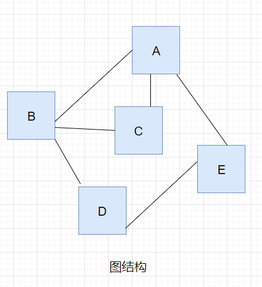
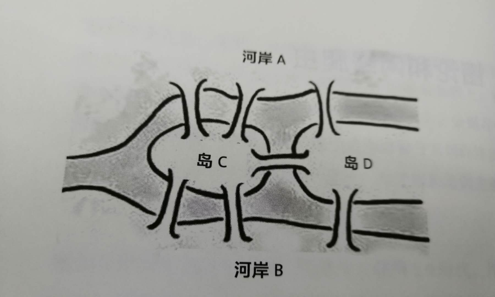
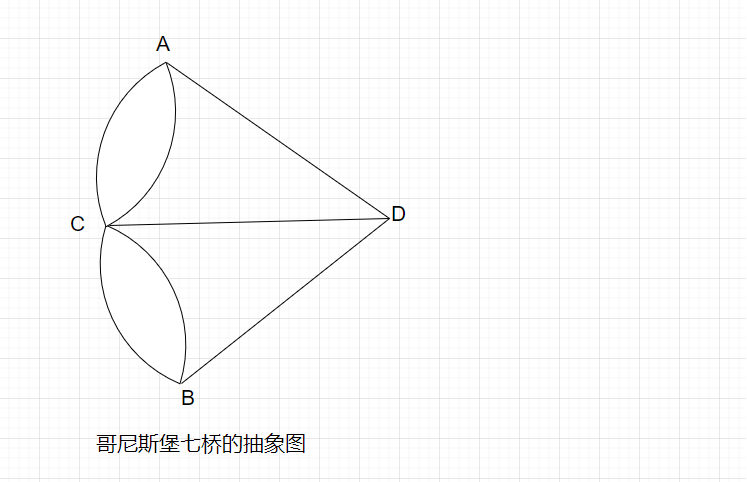

# 数据结构和算法练习记录

- 什么是数据结构？

存储和计算是程序的两大基础功能，数据结构是专门研究数据存储的学科。
很多时候，我们无法使用简单的数字、字符串、布尔就能完整的描述数据，
可能我们希望使用数组、对象、或者他们组合而成的符合结构对数据进行描述，
这种复合的结构就是数据结构。常见的数据结构有：**数组**、**链表**、**树**、**图**等

- 什么是算法？

存储和计算是程序的两大基础功能，算法是专门研究运算过程的学科。
一个程序，很多时候都需要根据一种已知数据，通过计算，得到另一个未知数据，
这个运算过程使用的方法，就是算法
常见的算法有：**穷举法**、**分治法**、**贪心算法**、**动态规划**等

- 数据结构和算法有什么关系？

一个面向的是存储，一个面向的是运算，他们共同构成了计算机程序的两个重要部分。
有了相应的数据结构，免不了对这种数据结构的各种变化进行计算，所以，很多时候，
某种数据机构都会自然而然的搭配不少的算法。

# 线性结构

线性结构是数据结构中的一种分类，用于表示一系列的元素形成的有序集合
常见的线性结构有**数组**、**链表**、**栈**、**队列**

## 数组 :grinning:

**数组是一整块连续的内存空间，它是由固定数量的元素组成，具有以下特征：**

1. 整个数组占用的内存空间是连续的
2. 数组中元素的数量是固定的（不可增加也不可减少），创建数组时就必须指定其长度
3. 每个元素占用的内存大小完全是一样的

所以在创建数组时，需要指定两个地方：

1. 数组的长度
2. 数组每个项占用的内存大小

根据数组的基本特征，可以推导出数据具有以下特点

1. 通过下标寻找元素的效率极高，因此遍历速度快
2. 无法添加和删除数据，虽然可以通过某种算法完成类似操作，但会增加额外的内存开销或者时间开销
3. 如果数组需要的空间很大，可能一时无法找到足够大的连续内存


## 链表 :smiley:

为弥补数组的缺陷而出现的一种数据结构，它具有以下基本特征：

1. 每个元素除了存储数据，需要有额外的内存存储一个引用（地址），来指向下一个元素
2. 每个元素占用的内存空间并不要求是连续的
3. 往往使用链表的第一个节点（根节点）来代表整个链表

> 在链表中，每个节点都可以作为根节点

根据链表的基本特征，可以推导出它具有以下特点：

1. 长度是可变的，随时可以增加和删除元素
2. 插入和删除元素的效率极高
3. 由于要存储下一个元素的地址，会增加额外的内存开销
4. 通过下标查询链表中的某个节点，效率很低，因此链表的下标遍历效率低


# 排序算法

> 排序算法没有优劣之分，在不同的场景中，不同的排序算法执行效率不同

- 原地排序： 不开辟新的内存空间存放数组中的数据（不新建数组）
- 非原地排序：要开辟新的内存空间存放数组中的数据(会新建数组)

1. **选择排序 Selection Sort :smile:** 

一次选择排序，可以将某个小区的最小值排列到该区域的第一位，具体的方式是：

- 找出该区域的最小值
- 将该值与该区域的第一个值交换
- 对下一个区域重复上述过程，直到排序完成

2. **冒泡排序 Bubble Sort :grin:**

一次冒泡排序，可以将某个区域序列的最大值排序到该区域的最后一位，具体方式如下：

- 将第1位和第2位比较，如果前者比后者大则交换
- 将第2位和第3位比较，如果前者比后者大则交换
- 依次类推，直到比较到该区域的最后两位
- 重复上述过程，直到排序完成

3. **插入排序 Insertion Sort :laughing:**

将序列分为两个部分，一部分是有序的，一部分是无序的，现在要做的是，
就是不断的从无序的部分取出数据，加入到有序的部分，直到整个排序完成

例如： 序列 [5, 7, 2, 3, 6]

- 分为有序的序列和无序的序列 (5) (7 2 3 6)
- 不断的扩充有序序列 (5 7) (2 3 6)
- 不断的扩充有序序列 (2 5 7) (3 6)
- 不断的扩充有序序列 (2 3 5 7) (6)
- 不断扩充有序序列 (2 3 5 6 7)
- 排序完成

4. **快速排序 Quick Sort :satisfied:**

选择一个数（比如序列的最后一位）作为基准数，将整个序列排成两部分，一部分比该数小，另一部分比该数大，基准数在中间，然后对剩余的序列做同样的事情，直到排序完成

例如：序列 [5, 7, 2, 3, 6, 4]

- 选择4作为基准数，排序成为：(3 2) 4 (7 6 5)
- 对于3，2，继续使用该方式排序， 得到 (2 3) 4 (7 6 5)
- 对于7,6,5，继续使用该方式排序，得到：(2 3) 4 (5 6 7)
- 排序完成

# 查询算法

1. **顺序查找 Inorder Search :apple:**

即普通的遍历，属于算法的穷举法

2. **二分查找 Binary Search :pear:**

如果一个序列是一个排序好的序列，则使用二分查找可以极大的缩短查找时间
具体的做法是：
查找该序列中中间未知的数据

  - 相等，找到
  - 要找的数据较大，则对后续部分的数据做同样的步骤
  - 要找的数据较小，则对前面部分的数据做同样的步骤


3. **插值查找 Interpolation Search :lemon:**

插值查找是对二分查找的进一步改进
如果序列不仅是一个排序好的序列，而且序列的步长大致相同，则使用插值查找

插值查找基于如下假设：下标之间的距离比和数据之间的距离比大致相同，即：

(目标下标 - 最小下标) / (最大下标 - 最小下标) ≈ (目标值 - 最小值) / (最大值 - 最小值)

因此可以计算出大致的下标落点：

目标下标 ≈ (目标值 - 最小值) / (最大值 - 最小值) * (最大下标 - 最小下标) + 最小下标

这样就可以计算出大致的下标落点，后续的比较和二分查找一样


# 树 

树是一个类似于链表的二维结构，每个节点可以指向0个或多个其他节点

树具有以下特点：
1. 单根：如果一个节点A指向了另一个节点B，仅能通过A直接找到B节点，不可能通过其他节点找到B节点
2. 无环：节点的指向不能形成环

树的术语：
1. 节点的度：某个节点的度 = 该节点子节点的数量
2. 树的度：一棵树中，最大的节点的度为该树的度
3. 节点的层：从艮开始定义起，根为第一层，根的子节点为第二层，以此类推
4. 树的高度或深度：树中节点的最大层次
5. 叶子节点：度为0的节点成为叶节点
6. 分支节点：非叶子节点
7. 子节点、父节点：相对概念，如果A节点有一个子节点B，则A是B的父节点，B是A的子节点
8. 兄弟节点：如果两个节点有同一个父节点，则他们互为兄弟节点
9. 祖先节点：某个节点的祖先节点，是从树的根到该节点本身经过的所有节点
10. 后代节点：如果A是B的祖先节点，B则是A的后代节点
11. 根节点：树的最顶端的节点是根节点
12. 子树： 

树的代码表示法：

```javascript
    function Node(value) {
        this.value = value;
        this.children = [];
    }
```

## 二叉树 :rocket:

一棵树的度为2，则该树是二叉树

二叉树可以用下面的代码表示

```javascript
    function Node(value) {
        this.value = value;
        this.left  = null;
        this.right = null;
    }
```

## 二叉树的相关算法 :artificial_satellite:

**eg: 有如下一棵二叉树**



用代码构建一颗上图的二叉树

```javascript
    /**
     *
     * 构建一个二叉树节点
     * @param {*} value
     */
    function Node(value) {
        this.value = value;
        this.left = null;
        this.right = null;
    }

    var a = new Node('a');
    var b = new Node('b');
    var c = new Node('c');
    var d = new Node('d');
    var e = new Node('e');
    var f = new Node('f');

    a.left = b;
    a.right = e;
    b.left = c;
    b.right = d;
    e.left = f;
```

1. 对二叉树遍历打印
    1. 前序遍历 DLR (先自己，再左边，后右边)

    ```javascript
        /**
         *前序遍历
        *
        * @param {*} root
        */
        function DLR(root) {
            if (!root) return;
            console.log(root.value);
            DLR(root.left);
            DLR(root.right);
        }
    ```

    2. 中序遍历 LDR (先左边，再自己，后右边)

    ```javascript
        /**
         *中序遍历
        *
        * @param {*} root
        */
        function LDR(root) {
            if (!root) return;
            LDR(root.left);
            console.log(root.value);
            LDR(root.right);
        }
    ```

    3. 后序遍历 LRD (先左边，再右边，后自己)

    ```javascript
        /**
         *后序遍历
        *
        * @param {*} root
        */
        function LRD(root) {
            if (!root) return;
            LRD(root.left);
            LRD(root.right);
            console.log(root.value);
        }

    ```

2. 根据前序遍历和中序遍历的结果，得到一颗二叉树

```javascript
    /**
     * 根据前序遍历和中序遍历的结果，得到一颗二叉树
     * 
     * 步骤： 
     * 首先进行错误预估 (如果前序和中序长度不等或者某个序列长度为0)
     * 1. 找出根的值，构建根节点
     * 2. 找出根节点在中序遍历中的索引值
     * 3. 找出左节点的前序遍历和中序遍历 递归getTree
     * 4. 找出右节点的前序遍历和中序遍历 递归getTree
     * 5. 最终根节点的left等于步骤3的结果
     * 6. 最终根节点的right等于步骤4的结果
     *
     * @param {*} dlr 前序遍历
     * @param {*} ldr 中序遍历
     */
    function getTree(dlr, ldr) {

        dlr = dlr.split("");
        ldr = ldr.split("");
        if (dlr.length !== ldr.length) throw new Error('无效的数据');
        if (dlr.length === 0) return null;

        var rootValue = dlr[0]; // 找出根节点的值
        var root = new Node(rootValue); // 构建根节点

        var rootIndex = ldr.indexOf(rootValue); // 找出根节点在中序遍历中的索引
        // 分割出左节点的前序遍历和中序遍历
        var leftLdr = ldr.slice(0, rootIndex).join(""); // 左边节点的中序遍历
        var leftDlr = dlr.slice(1, leftLdr.length + 1).join(""); // 左节点的前序遍历
        root.left = getTree(leftDlr, leftLdr);
    
        var rightLdr = ldr.slice(rootIndex + 1).join(""); // 右节点的中序遍历
        var rightDlr = dlr.slice(leftLdr.length + 1).join(""); // 右节点的前序遍历
        root.right = getTree(rightDlr, rightLdr);

        return root; // 返回根节点
    }
```

3. 计算树的深度

```javascript
    /**
     * 得到一棵树的深度
     * 思路：
     * 一棵树的深度等于左右节点的深度最大值加1
     * @param {*} root
     */
    function getDeep(root) {
        if(!root) return 0;
        return Math.max(getDeep(root.left), getDeep(root.right)) + 1;
    }
    console.log(getDeep(a)); // 3
```

4. 查询二叉树
    1. 深度优先(DFS)

    ```javascript
        /**
        * 深度优先检测某个值是否在二叉树中
        *
        * @param {*} root
        * @param {*} targetValue
        */
        function deepFirstSearch(root, targetValue) {
            // 如果入的节点为空
            if (!root) return false; 
            // 如果要检测的值就是根节点的值
            if (root.value === targetValue) { 
                return true 
            } else {
                // 如果根节点的值不是目标值，则依次查询根的左节点，右节点
            return deepFirstSearch(root.left, targetValue) || deepFirstSearch(root.right, targetValue);
            }
        }
    ```

    2. 广度优先遍历 (BFS)

    ```javascript
        /**
         *
        * 广度优先检测某个值是否在二叉树中
        * @param {*} nodes 数组 某一层的所有节点
        * @param {*} targetValue
        */
        function breadthFirstSearch(nodes, targetValue) {
            if (nodes.length === 0) return false; // 搜不到
            var nexts = []; // 下一层的节点
            for (var i = 0; i < nodes.length ; i++) {
                // 如果在当层中搜到
                if (nodes[i].value === targetValue) {
                    return true;
                } else {
                    // 否则就把节点的下一层左右节点添加进下一层节点中去
                    if(nodes[i].left) {
                        nexts.push(nodes[i].left)
                    }
                    if(nodes[i].right) {
                        nexts.push(nodes[i].right)
                    }
                }
            }
            // 再进行下一层的搜索
            return breadthFirstSearch(nexts, targetValue);
        }
    ```

5. 比较两颗二叉树，得到比较的结果

```javascript
    /**
     * 比较两颗树的不同
     *
     * @param {*} originRoot
     * @param {*} newRoot
     */
    function diff(originRoot, newRoot) {
        var result = []; // 用于存放两棵树的不同
        // 如果两棵树都是空的
        if(!originRoot && !newRoot) {
            return [];
        } else if (!originRoot && newRoot) {
            // 如果原来树是空的，新树有数据则为新增
            result.push({
                type: '新增',
                originNode: originRoot,
                newNode: newRoot
            })
        } else if (originRoot && !newRoot) {
            // 如果原来的树有数据， 新树为空则为删除
            result.push({
                type: '删除',
                originNode: originRoot,
                newNode: newRoot
            })
        } else if (originRoot.value !== newRoot.value) {
            // 修改
            result.push({
                type: '修改',
                originNode: originRoot,
                newNode: newRoot
            })
            // 还需继续比较左右子节点
            var resultLeft = diff(originRoot.left, newRoot.left);
            var resultRight = diff(originRoot.right, newRoot.right);
            // 将后续的差异汇总到最开始的一开始的不同
            result = [...result, ...resultLeft, ...resultRight]
        } else {
            // 两个节点一样继续向后比较
            var resultLeft = diff(originRoot.left, newRoot.left);
            var resultRight = diff(originRoot.right, newRoot.right);
            // 将后续的差异汇总到最开始的一开始的不同
            result = [...result, ...resultLeft, ...resultRight]
        }
        return result;
    }
```
6. 将一个数组，转换为排序二叉树
7. 在一个排序二叉树中查找目标


# 图结构

> 图结构中，一个节点可以链接到任意节点，所有节点链接而成的结构，即为图结构

- 图结构中的链接可以是有向的，也可以是无向的(双向链接)
- 树结构是一种特殊的图
- 图结构没有根，可以有环，但是在一个图结构中，不能存在两个或以上的孤立的节点
- 可以使用图中任意一个节点表示整个图结构
- 图结构是一种常见的数据结构，例如网络爬虫抓取的网页就是一直典型的图结构

图结构的代码可以表示为

```javascript
    function Node(value) {
        this.value = value;
        this.neighbors = [];
    }
```

# 图的相关算法

eg: 有如下图一个图



将上图转为代码表示

```js
    function Node(value) {
        this.value = value;
        this.neighbors = []
    }

    var a = new Node('a');
    var b = new Node('b');
    var c = new Node('c');
    var d = new Node('d');
    var e = new Node('e');

    a.neighbors.push(b, c, e);
    b.neighbors.push(a, c, d);
    c.neighbors.push(a, b);
    d.neighbors.push(b, e);
    e.neighbors.push(a, d);
```

1. 查询算法

和树结构一样，图结构的查询也可以分为深度优先(Depth First Search)和广度优先(Breadth First Search)查询:


- 深度优先查询算法(DFS)

    ```js
        /**
         *
         *  图结构的深度遍历搜索
         * @param {*} node 
         * @param {*} targetValue
         * @param {*} funded 已经找过的节点
         */
        function depthFirstSearch(node, targetValue, funded) {
            // 如果funded数组中已经包含了node，就代表节点已经看过了 直接返回
            if(funded.includes(node)) {
                return false;
            }
            // 如果传入的节点的值等于目标搜索值 则查询成功
            if (node.value === targetValue) return true;
            funded.push(node); // 将当前节点加入到funded
            // 否则就对下面的邻居进行深度遍历
            for (var i = 0; i < node.neighbors.length; i++) {
                const item = node.neighbors[i];
                if(depthFirstSearch(item, targetValue, funded)) {
                    // 在其中一个节点的深搜过程中找到了
                    return true;
                }
            }
            return false; // 所有节点的深搜过程中都没有找到值 就返回false
            
        }
        var result = breadthFirstSearch([a], 'c', []);
        console.log('深度优先遍历', result); // true
    ```

- 广度优先查询(BFS)

    ```js
        /**
         *
         *
         * @param {*} nodes 某一层的节点
         * @param {*} targetValue
         * @param {*} funded 已经找过的节点
         */
        function breadthFirstSearch(nodes, targetValue, funded) {
            if (nodes.length === 0) return false; // 如果节点都不存在了就肯定找不到
            var nexts = [];
            for(var i = 0; i < nodes.length; i++) {
                if (nodes[i].value === targetValue) {
                    // 如果在当前层的节点中找到了目标值
                    return true;
                }
                // 如果没有找到，则把该节点添加进funded
                !funded.includes(nodes[i]) && funded.push(nodes[i]);
                // 然后过滤该节点的neighbors中没有在funded和nexts中的节点 赋值给nexts
                nexts = nexts.concat(nodes[i].neighbors.filter(item => !funded.includes(item) && !nexts.includes(item)));
            }
            // 进行下层寻找
            return breadthFirstSearch(nexts, targetValue, funded);
        }

        var result = breadthFirstSearch([a], 'f', []);
        console.log('广度优先遍历', result); // false
    ```

2. 最小生成树算法

如果一个图中节点连接而成的边具备某种数值，需要将这些边进行精简，生成一个连接
全部节点同时总边长最小的树结构，该树称之为最小生成树

实现最小生成树可以使用**Prim**算法，从任意一个点出发，连接到该点最短的点，组成一个部落
，然后继续连接到该部落最短的点，直到所有点连接完成。

## 图结构扩展 :lemon:

图结构的起源可追溯到大数学家欧拉(Leonhard Euler)所处的那个年代。1736年，欧拉来到普鲁士的哥尼斯堡,发现当地居民有一项消遣活动，就是试图将下图中的每座桥恰好走过一遍并回到原出发点，但是没有人成功过。欧拉证明了这种走法是不可能的。



**证明结论如下:**

把每一块连通的陆地作为一个顶点，每一座桥当成图的一条边，那么就把哥尼斯堡的七座桥抽象成下面的图：



对于图中的每一个顶点，将与之相连的边的数量定义为它的度

**定理：** 如果一个图能够从一个顶点出发，每条边不重复的遍历一遍回到这个顶点，那么每一顶点的度必须是偶数。

**证明：** 假如能够遍历图的每一条边各一次，那么对于每个顶点，需要从某条边进入该顶点，同时从另外一条边离开该这个顶点。进入和离开顶点的次数是相同的，因此每个顶点有多少条进入的边，就有多少条出去的边。也就是说，每个顶点相连的边的数量是成对出现的，即每个顶点的度是偶数。

在上图中，有多个顶点的度是奇数，因此，这个图无法从一个顶点出发，遍历每条边各一次然后回到原顶点

# 贪心算法

当遇到一个求解全局最优解问题时，如果可以将全局问题切分为小的局部问题，并**寻求局部最优解**，
同时可以证明**局部最优解累计的结果是全局最优解**，则可以使用贪心算法

面试题：找零问题

eg: 假设你有一间小店，需要找给客户46分钱的硬币，逼得货柜里只有面额为25分、10分、5分、1分的硬币
如何找零才能保证数额**正确**并且硬币数**最小**

# 动态规划

分治法有一个问题，就是容易重复甲酸已经算过的值，使用动态规划，可以每一次分治法时算出的值记录下来，防止重复计算，从而提高效率

面试题：青蛙跳台阶问题

eg：有N级台阶，一只青蛙每次可以跳1级或者两级，一共有多少种跳法可以跳完台阶？

面试题：最长公共子序列问题
eg: 有的时候，我们需要比较两个字符串的相似程度，通常就是比较两个字符串有多少相同的公共子序列

例如有两个字符串
- *abhfsde* *jdwasde*
返回的相同公共子序列是：asde